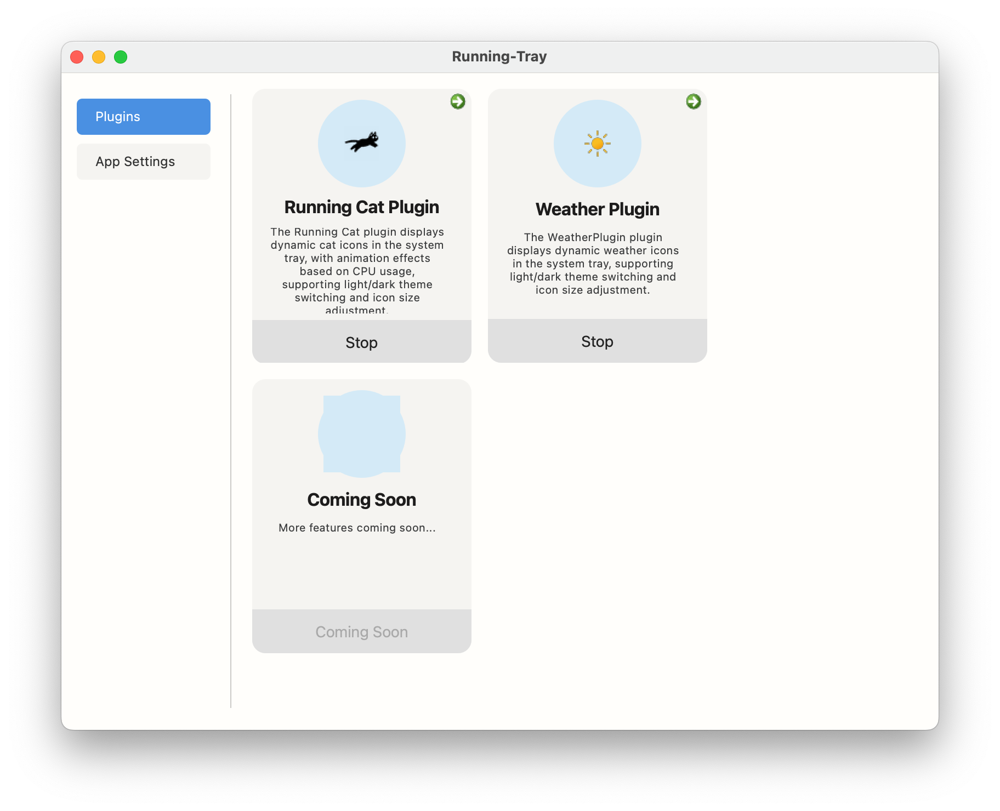
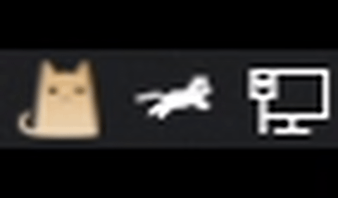

# 🧰 running_tray

a cross-platform Qt-based desktop application that implements a plugin-based system tray manager. The application serves as a host for extensible system tray plugins, with primary implementations including a CPU monitoring plugin that displays animated system tray icons and a weather plugin that shows animated weather conditions.
Project inspiration and some icon resources are borrowed from [RunCat_for_windows](https://github.com/Kyome22/RunCat_for_windows).

> 📖 Online documentation is automatically generated by [DeepWiki](https://deepwiki.com/supreme886/running_tray), supporting structure diagrams and natural language Q&A.

**Language**: [English](README.md) | [中文](README-CN.md)

---

## 🎬 Application Demo

### macOS Demo Video

*Shows the application running on macOS system*

### macOS Interface Screenshot

*Application interface screenshot on macOS system*

### Windows Demo Video

*Shows the application running on Windows system*

---

## 📥 Download & Installation

Visit the [Releases](https://github.com/supreme886/running-tray/releases) page to get the latest version:

- **Windows**: [running-tray_setup.exe](https://github.com/supreme886/running_tray/releases/download/v1.0.0/running-tray_setup.exe)
- **macOS**: [running-tray.dmg](https://github.com/supreme886/running_tray/releases/download/v1.0.0/Running-Tray-v1.0.0-x86_64.dmg)

---

## ✨ Key Features

- Tray icon displays task status
- Start, stop, and hot-reload plugin services
- Support for Windows, macOS, and Linux
- Support for custom plugins
- Deep integration with DeepWiki for better structure understanding

---

# Inspiration

The running_tray project draws inspiration and some icon resources from:

[RunCat_for_windows](https://github.com/Kyome22/RunCat_for_windows)

This project has greatly inspired us with its simple tray animations and lightweight running mechanism.  
We appreciate its excellent design and open-source spirit, and have made improvements and extensions based on it.

# Documentation & Structure

Project documentation is automatically generated by [DeepWiki](https://deepwiki.com/supreme886/running_tray) with the following features:

- **Module Structure Diagrams**  
  Visualize dependencies and call chains between modules

- **Function & Class Documentation**  
  Detailed analysis of function purposes, parameters, and return values to improve reading comprehension

- **Natural Language Q&A**  
  AI-assisted natural language queries about code functionality and design philosophy

- **Continuous Updates**  
  DeepWiki automatically updates documentation based on code changes, keeping content current

---

Visit: [DeepWiki running_tray Documentation](https://deepwiki.com/supreme886/running_tray)

# Contributing

Thank you for your interest and willingness to contribute to this project!

## How to Contribute

- Submit bug reports (Issues)
- Submit feature suggestions (Issues)
- Code Pull Requests

## Guidelines

- Please check existing Issues first to avoid duplicates
- PRs should be based on the latest main branch and pass relevant tests
- Follow code style and commenting conventions
- For UI changes, please include screenshots or recordings
- Multi-platform support is especially welcome

---

# 🚀 Future Plans

We are actively developing and improving running_tray. Here are our short-term and long-term development plans:

## 🎯 Short-term Plans

- **Interface Optimization**  
  Optimize interface styles to improve user experience

- **Multi-theme Support**  
  Add more animation themes, such as cute animal characters like dogs, rabbits, birds, etc.

- **Performance Optimization**  
  Optimize CPU usage detection algorithms to reduce the application's own resource consumption

- **Plugin Ecosystem**  
  Improve plugin development documentation and provide more example plugins

- **Internationalization Support**  
  Add multi-language support (English, Japanese, etc.)

## 🔮 Long-term Vision

- **Cloud Sync Features**  
  Support cloud synchronization of configurations and themes for seamless multi-device switching

- **Extended System Monitoring**  
  Add visualization for system metrics like memory, network, disk, etc.

- **Custom Animation Editor**  
  Provide a graphical interface for users to create and share custom animations

- **Mobile Companion App**  
  Develop mobile applications for remote monitoring and control

- **Installation Package Size Optimization**  
  Optimize installation package structure to reduce size and save space

---

# License

This project is open-sourced under the MIT License.

You are free to use, copy, modify, merge, publish, distribute, sublicense, and/or sell copies of this software, but you must include the original copyright notice and license notice.

For details, please refer to [MIT License](LICENSE).

---

If you have good ideas or suggestions, welcome to participate in the project through Issues or PRs!

---

Copyright © [supreme886](https://github.com/supreme886)